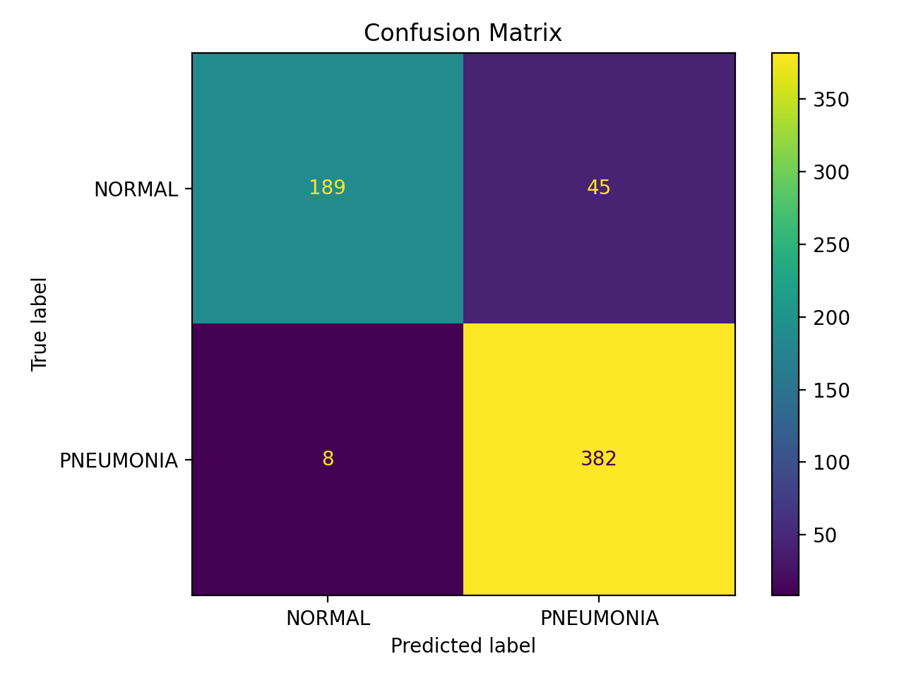

# Chest X-ray Pneumonia Classification with Grad-CAM

## 1. Overview
This project implements a deep learning pipeline to classify pneumonia from chest X-ray images and provides visual explanations using Grad-CAM.

The objective is not only to build a classification model, but also to evaluate it with clinically relevant metrics and improve interpretability in a medical imaging setting.

---

## 2. Key Features
- Binary classification: NORMAL vs PNEUMONIA
- Transfer learning with ResNet18 (ImageNet pretrained)
- End-to-end pipeline:
  - Training
  - Evaluation
  - Inference
  - Grad-CAM visualization
- Clinical/statistical evaluation metrics:
  - Sensitivity
  - Specificity
  - ROC-AUC
  - Confusion Matrix
- Config-driven experiment management
- Modular code structure

---

## 3. Dataset
This project uses the Chest X-Ray Images (Pneumonia) dataset from Kaggle.

Expected dataset structure:

```text
data/raw/chest_xray/
├── train/
│   ├── NORMAL/
│   └── PNEUMONIA/
├── val/
│   ├── NORMAL/
│   └── PNEUMONIA/
└── test/
    ├── NORMAL/
    └── PNEUMONIA/
```

The dataset is not included in this repository.

### Test Set Distribution
| Class | Count |
|---|---:|
| NORMAL | 234 |
| PNEUMONIA | 390 |
| Total | 624 |

---

## 4. Model Architecture
- Backbone: ResNet18
- Pretraining: ImageNet pretrained weights
- Final layer modified for binary classification
- Single-logit output
- Loss function: BCEWithLogitsLoss

---

## 5. Training Setup
- Optimizer: Adam
- Input size: 224 × 224
- Threshold: 0.5
- Best checkpoint selected based on validation F1-score
- Data augmentation:
  - Horizontal flip
  - Small rotation

---

## 6. Evaluation Results

The best checkpoint was selected based on validation F1-score and evaluated on the held-out test set.

| Metric | Value |
|---|---:|
| Accuracy | 0.9151 |
| Precision / PPV | 0.8946 |
| Recall / Sensitivity | 0.9795 |
| Specificity | 0.8077 |
| F1-score | 0.9351 |
| ROC-AUC | 0.9748 |
| Test Loss | 0.2717 |

### Confusion Matrix Values

|  | Predicted NORMAL | Predicted PNEUMONIA |
|---|---:|---:|
| Actual NORMAL | 189 | 45 |
| Actual PNEUMONIA | 8 | 382 |

### Clinical Interpretation
The model achieved high sensitivity, indicating that relatively few pneumonia cases were missed on the test set. Specificity was lower than sensitivity, suggesting that false positives occurred more frequently than false negatives.

---

## 7. Grad-CAM Visualization

Grad-CAM was used to visualize image regions that contributed to the model’s prediction.

### Example


---

## 8. Confusion Matrix Visualization

The confusion matrix summarizes true positives, false positives, true negatives, and false negatives.



---

## 9. How to Run

### 9.1 Install
```bash
pip install -r requirements.txt
pip install -e .
```

### 9.2 Train
```bash
python scripts/train.py --config configs/config.yaml
```

### 9.3 Evaluate
```bash
python scripts/evaluate.py \
  --config configs/config.yaml \
  --checkpoint outputs/checkpoints/best_model.pt
```

### 9.4 Inference
```bash
python scripts/infer.py \
  --config configs/config.yaml \
  --checkpoint outputs/checkpoints/best_model.pt \
  --image_path <path_to_image>
```

### 9.5 Generate Grad-CAM
```bash
python scripts/generate_gradcam.py \
  --config configs/config.yaml \
  --checkpoint outputs/checkpoints/best_model.pt \
  --image_path <path_to_image>
```

---

## 10. Project Structure

```text
xray-pneumonia-classification-gradcam/
├── assets/
│   ├── gradcam_example.png
│   └── confusion_matrix.png
├── configs/
│   └── config.yaml
├── scripts/
│   ├── train.py
│   ├── evaluate.py
│   ├── infer.py
│   └── generate_gradcam.py
├── src/
│   └── xray_cls/
│       ├── data/
│       ├── models/
│       ├── engine/
│       ├── utils/
│       └── explain/
├── requirements.txt
├── setup.py
└── README.md
```

---

## 11. Key Design Decisions
- Used transfer learning to improve training stability with limited medical imaging data
- Adopted a single-logit output with BCEWithLogitsLoss for binary classification
- Separated dataset, model, training, evaluation, and explainability modules
- Added clinically interpretable metrics such as sensitivity and specificity
- Included Grad-CAM to inspect whether the model attends to clinically relevant image regions

---

## 12. Limitations
- Only ResNet18 baseline is currently implemented
- Class imbalance handling is not fully optimized
- External validation was not performed
- Cross-validation was not applied
- The validation split in the original dataset is very small, so validation metrics can be unstable
- Grad-CAM provides visual explanation but should not be interpreted as definitive clinical evidence

---

## 13. Future Work
- Compare ResNet18 with DenseNet and EfficientNet
- Add ROC curve and precision-recall curve visualization
- Apply class imbalance handling such as weighted loss or focal loss
- Add calibration analysis
- Perform external validation on data from different sources
- Extend the pipeline to multi-label chest X-ray classification

