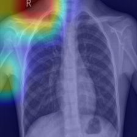

# Chest X-ray Pneumonia Classification + Grad-CAM

의료 영상 기반 이진 분류 프로젝트입니다.  
흉부 X-ray에서 폐렴 여부를 분류하고, Grad-CAM으로 모델이 주목한 영역을 시각화합니다.

## Features
- Binary classification: NORMAL vs PNEUMONIA
- Transfer learning with ResNet18
- Grad-CAM explainability
- Train / Evaluate / Infer / Visualization 분리
- Config 기반 실험 관리

## Project Structure
```text
xray-pneumonia-classification-gradcam/
├─ README.md
├─ requirements.txt
├─ setup.py
├─ configs/
│  └─ config.yaml
├─ scripts/
│  ├─ train.py
│  ├─ evaluate.py
│  ├─ infer.py
│  └─ generate_gradcam.py
└─ src/
   └─ xray_cls/
      ├─ data/
      ├─ models/
      ├─ engine/
      ├─ utils/
      └─ explain/

# Dataset structure

data/raw/chest_xray/
├─ train/
│  ├─ NORMAL/
│  └─ PNEUMONIA/
├─ val/
│  ├─ NORMAL/
│  └─ PNEUMONIA/
└─ test/
   ├─ NORMAL/
   └─ PNEUMONIA/


   ## Sample Result

### Grad-CAM Example
